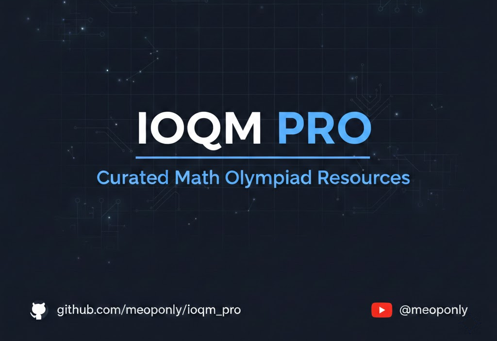

  

# IOQM Pro - Minimalist Curriculum Library

**IOQM Pro** is a comprehensive, minimalist library designed to streamline preparation for the Indian Olympiad Qualifier in Mathematics (IOQM). This platform aggregates high-quality video lectures, practice modules, and curated resources into a single, distraction-free interface.

> [!IMPORTANT]
> **Disclaimer:** **IOQM Pro** is an unofficial, student-made resource index. All educational content, video lectures, and study modules linked in this repository are the intellectual property of **Physics Wallah (PW)**. This project is intended for educational purposes only—to provide an organized, minimalist interface for students to access publicly available PW resources more efficiently.

---

## 🚀 Features

* **Minimalist UI:** A clean, grid-based dashboard for quick access to topics.
* **Categorized Learning:** Resources are divided into Foundation, Core, Advanced, and Community levels.
* **Direct Resource Access:** Integrated links to YouTube playlists, PDF modules, and practice sheets.
* **Responsive Design:** Optimized for seamless viewing on both mobile and desktop devices.

## 📚 Curriculum Overview

The library covers the complete IOQM syllabus, including:

* **Number Theory:** Comprehensive 3-part series.
* **Algebra:** Polynomials, Quadratic Equations, Sequences & Series, and Inequalities.
* **Geometry:** Triangles, Quadrilaterals, Circles, and Coordinate Geometry.
* **Combinatorics & Probability:** Advanced counting techniques and probability theory.
* **Specialized Topics:** Recurrence Relations, Binomial Theorem, and Functional Equations.

## 🛠️ Built With

* **HTML5 & CSS3:** For a lightweight and responsive structure.
* **GitHub Pages:** For fast and reliable hosting.
* **Font Awesome:** For intuitive iconography.

## 📖 How to Use

1. **Visit the Site:** Go to [meoponly.github.io/ioqm_pro/](https://meoponly.github.io/ioqm_pro/).
2. **Select a Topic:** Click on any card (e.g., Number Theory or Geometry).
3. **Start Learning:** You will be directed to the relevant video playlist or resource file.

## 🤝 Contributing

Contributions are welcome! If you have suggestions for new resources or UI improvements:

1. Fork the Project.
2. Create your Feature Branch (`git checkout -b feature/AmazingFeature`).
3. Commit your Changes (`git commit -m 'Add some AmazingFeature'`).
4. Push to the Branch (`git push origin feature/AmazingFeature`).
5. Open a Pull Request.

## 📄 License

Distributed under the MIT License. See `LICENSE` for more information.

## 📬 Contact

**Meoponly** YouTube: [@meoponly](https://www.youtube.com/@meoponly)  
**Project Link:** [https://github.com/meoponly/ioqm_pro](https://github.com/meoponly/ioqm_pro)

---
*Developed with ❤️ for the Mathematics Community.*
